# 基于 VirtualBox 的网络攻防基础环境搭建

## 实验目的

- 掌握 VirtualBox 虚拟机的安装与使用；
- 掌握 VirtualBox 的虚拟网络类型和按需配置；
- 掌握 VirtualBox 的虚拟硬盘多重加载；

## 实验环境

以下是本次实验需要使用的网络节点说明和主要软件举例：

- VirtualBox 虚拟机
- 攻击者主机（Attacker）：Kali Rolling 2019.2
- 网关（Gateway, GW）：Debian Buster
- 靶机（Victim）：From Sqli to shell / xp-sp3 / Kali

## 实验要求

- 虚拟硬盘配置成多重加载，效果如下图所示；

- 搭建满足如下拓扑图所示的虚拟机网络拓扑；

> 根据实验宿主机的性能条件，可以适度精简靶机数量

- 完成以下网络连通性测试；
  - [x] 靶机可以直接访问攻击者主机
  - [x] 攻击者主机无法直接访问靶机
  - [x] 网关可以直接访问攻击者主机和靶机
  - [x] 靶机的所有对外上下行流量必须经过网关
  - [x] 所有节点均可以访问互联网

## 实验过程

- ### 虚拟硬盘配置多重加载

  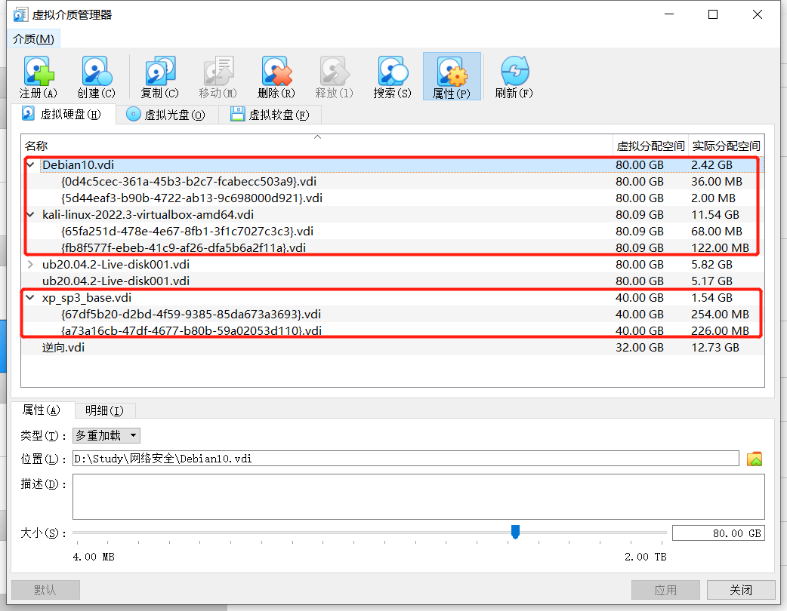

- ### 搭建网络拓扑

  `Debian_gateway`网卡设置：

  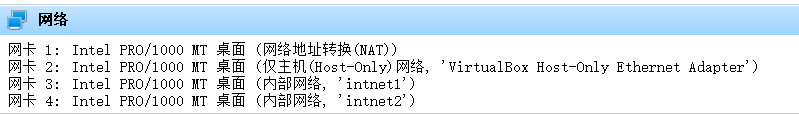

  靶机与攻击者各配置好网卡后，获取各个主机IP地址：

  | 虚拟机         | IP地址         |
  | -------------- | -------------- |
  | kali_attacker  | 10.0.2.15      |
  | kali_victim1   | 172.16.111.115 |
  | XP_victim1     | 172.16.111.132 |
  | XP_victim2     | 172.16.222.132 |
  | debian_victim2 | 172.16.222.146 |

  

- ### 完成以下网络连通性测试

  - 靶机可以直接访问攻击者主机

    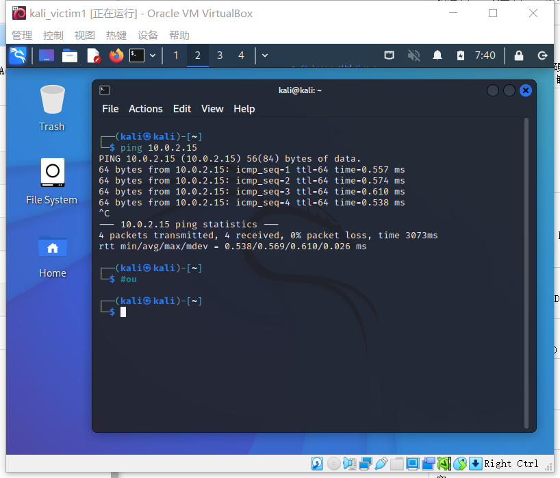

  - 攻击者主机无法直接访问靶机

    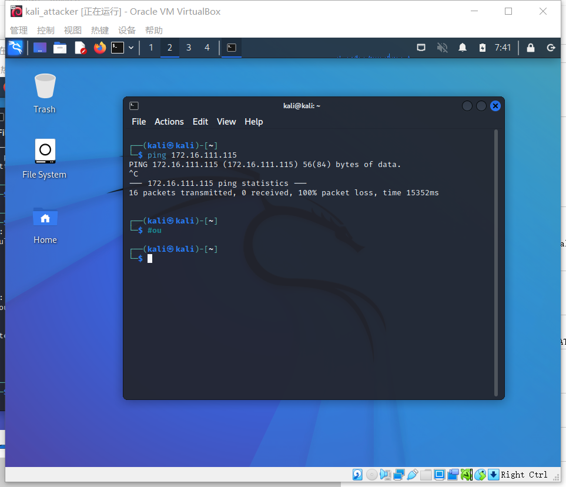

  - 网关可以直接访问攻击者主机和靶机

    网关访问攻击者：

    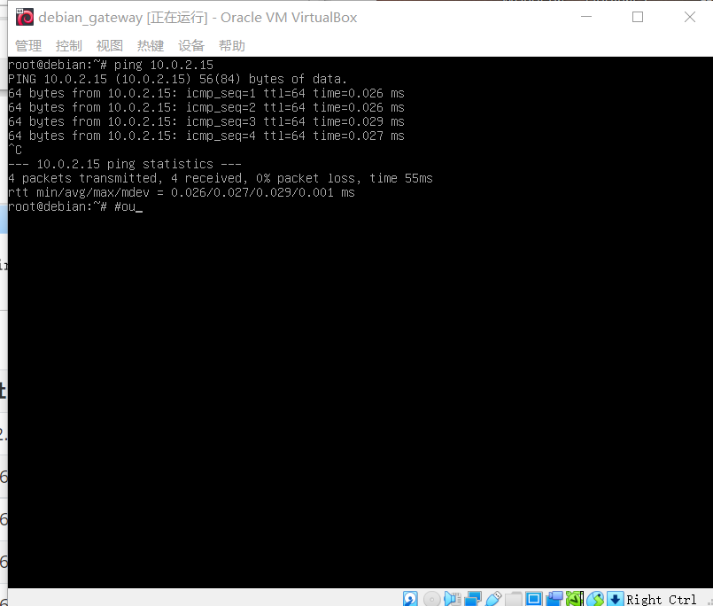

    网关访问靶机：

    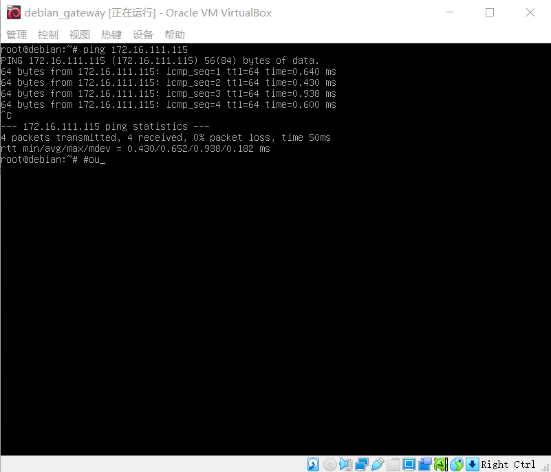

  - 靶机的所有对外上下行流量必须经过网关

    使用`tcpdump`工具进行抓包，在靶机`kali_victim1`中进行网络操作（IP：172.16.111.115）。

    抓包后在`wireshark`中进行分析：

    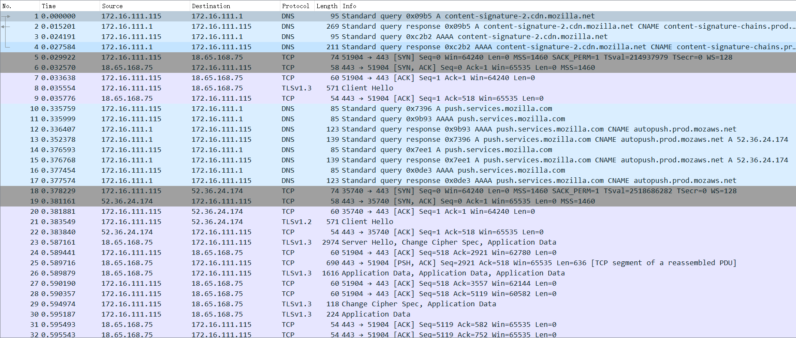

  - 所有节点均可以访问互联网

    网关：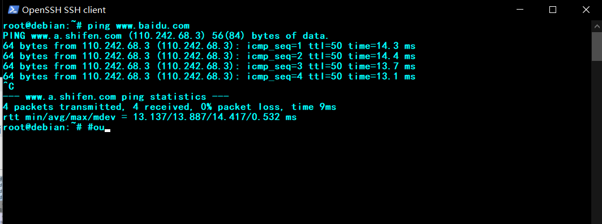

    

    攻击者：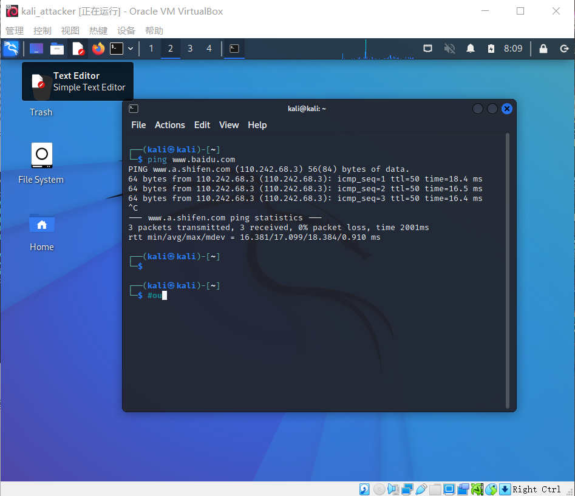

    

    靶机：

    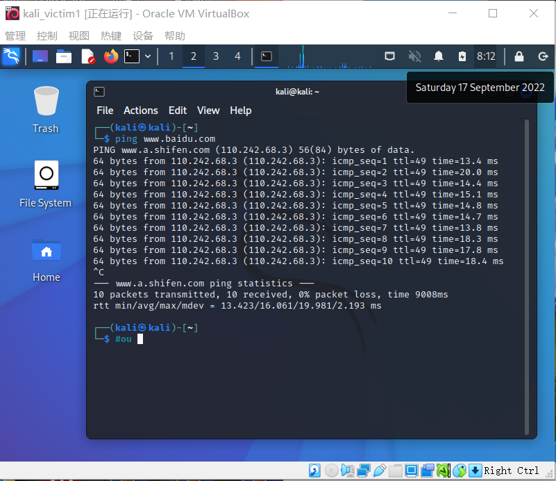
    
    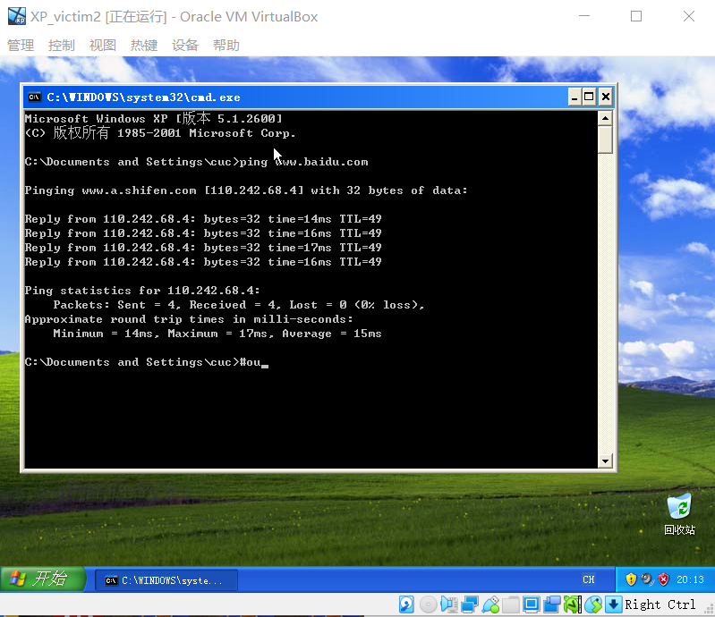

## 参考资料

-   [tcpdump 抓包使用小结](https://wsgzao.github.io/post/tcpdump/)

