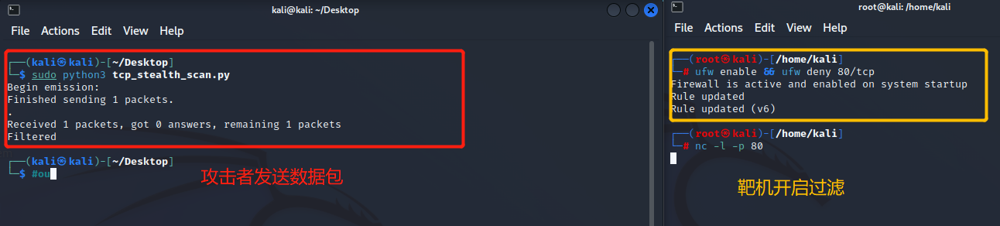
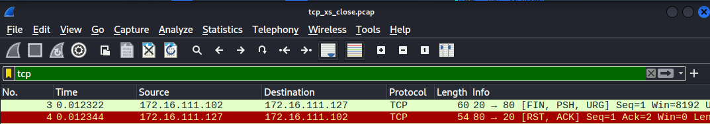
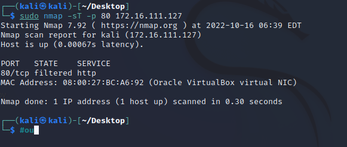
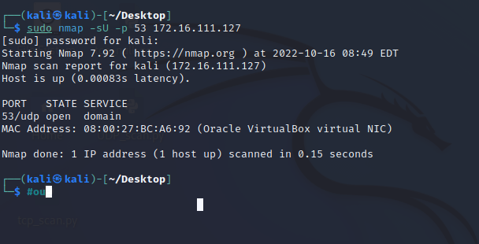

# 基于 Scapy 编写端口扫描器

## 实验目的

- 掌握网络扫描之端口状态探测的基本原理

## 实验环境

- `python `+ [`scapy`](https://scapy.net/)

## 实验要求

- 禁止探测互联网上的 IP ，严格遵守网络安全相关法律法规
- 完成以下扫描技术的编程实现
  - [x] TCP connect scan / TCP stealth scan
  - [x] TCP Xmas scan / TCP fin scan / TCP null scan
  - [x] UDP scan
- [x] 上述每种扫描技术的实现测试均需要测试端口状态为：`开放`、`关闭` 和 `过滤` 状态时的程序执行结果
- [x] 提供每一次扫描测试的抓包结果并分析与课本中的扫描方法原理是否相符？如果不同，试分析原因；
- [x] 在实验报告中详细说明实验网络环境拓扑、被测试 IP 的端口状态是如何模拟的
- [x] （可选）复刻 `nmap` 的上述扫描技术实现的命令行参数开关

## 实验网络环境拓扑


## 实验端口状态模拟

- 开启状态

  ```shell
  systemctl start apache2 # port 80
  systemctl start dnsmasq # port 53
  ```

- 关闭状态

  ```shell
  ufw disable
  ```

- 过滤状态

  ```shell
  ufw enable && ufw deny 80/tcp  #tcp port:80
  
  ufw enable && ufw deny 53/tcp  #udp port:53
  ```

  

## 实验过程

- ### TCP connect scan

  > 如果接收到的是一个 SYN/ACK 数据包，则说明端口是开放状态的；如果接收到的是一个 RST/ACK 数据包，通常意味着端口是关闭的并且链接将会被重置；而如果目标主机没有任何响应则意味着目标主机的端口处于过滤状态。

  - #### 开放

    - 首先在靶机中开启监听

      ```shell
      ufw enable && ufw allow 80/tcp 
      
      nc -l -p 80 #开启防火墙并监听对应端口
      ```

    - 随后攻击者发送数据包,同时靶机使用`tcpdump`进行抓包

      ```shell
      sudo tcpdump -i eth0 -w tcp_co.pcap
      #使用tcpdump抓包
      ```

      

    - 打开`wireshark`分析数据包，靶机向攻击者发送了[SYN,ACK]数据包，端口开放：

      

    - `nmap`复刻

      

  - #### 关闭

    - 首先在靶机中关闭防火墙

      ```shell
      ufw disable 
      #关闭防火墙
      ```

    - 随后攻击者尝试发送数据包，同时靶机使用`tcpdump`进行抓包

      

    - 打开`wireshark`分析数据包，端口关闭：(接收到RST数据包)

      

    - `nmap`复刻

      

  - #### 过滤

    - 首先在靶机中开启防火墙并开启过滤

      ```shell
      ufw enable && ufw deny 80/tcp
      ```

    - 随后攻击者发送数据包,同时靶机使用`tcpdump`进行抓包

      

    - 打开`wireshark`分析数据包，只有一个`tcp`数据包,说明端口处于过滤状态：

      

    - `nmap`复刻

      


- ### TCP stealth scan

  > 发送一个 SYN 包启动三方握手链接机制，并等待响应。如果我们接收到一个 SYN/ACK 包表示目标端口是开放的；如果接收到一个 RST/ACK 包表明目标端口是关闭的；如果端口是被过滤的状态则没有响应。

  - #### 开放

    - 在靶机上开启防火墙并开启端口监听，攻击者发送数据包同时靶机抓取数据包

      

    - 打开`wireshark`分析数据包，靶机向攻击者发送了[SYN,ACK]数据包，端口开放：

      

    - `nmap`复刻

      

  - #### 关闭

    - 在靶机上关闭防火墙，攻击者尝试发送数据包同时靶机抓取数据包

      

    - 打开`wireshark`对数据包进行分析，接收到RST数据包，端口关闭：

      

    - `nmap`复刻

      

  - #### 过滤

    - 在靶机上打开防火墙并开启过滤，攻击者发送数据包同时靶机进行抓包

      

    - 打开`wireshark`对数据包进行分析，只有一个`tcp`数据包,说明端口处于过滤状态：

      

    - `nmap`复刻

      


- ### TCP Xmas scan 

  > Xmas 发送一个 TCP 包，并对 TCP 报文头 FIN、URG 和 PUSH 标记进行设置。若是关闭的端口则响应 RST 报文；开放或过滤状态下的端口则无任何响应。

  - #### 开启

    - 在靶机上开启防火墙并开启端口监听，攻击者发送数据包同时靶机抓取数据包

      

    -  打开`wireshark`对数据包进行分析，只有一个`tcp`数据包,说明端口处于打开或过滤状态：

      

    - `nmap`复刻

      

  - #### 关闭

    -  在靶机上关闭防火墙，攻击者尝试发送数据包同时靶机抓取数据包

      

    -  打开`wireshark`对数据包进行分析，接收到RST数据包，端口关闭：

      

    - `nmap`复刻

      

  - #### 过滤

    - 在靶机上打开防火墙并开启过滤，攻击者发送数据包同时靶机进行抓包

      

    - 打开`wireshark`对数据包进行分析，只有一个`tcp`数据包,说明端口处于过滤状态：

      

    - `nmap`复刻

      

       

      

- ### TCP fin scan

  > 仅发送 FIN 包，它可以直接通过防火墙，如果端口是关闭的就会回复一个 RST 包，如果端口是开放或过滤状态则对 FIN 包没有任何响应。

  - #### 开启

    - 在靶机上开启防火墙并开启端口监听，攻击者发送数据包同时靶机抓取数据包

      

    -  打开`wireshark`对数据包进行分析，只有一个`tcp`数据包,说明端口处于打开或过滤状态：

      

    - `nmap`复刻

      

  - #### 关闭

    -  在靶机上关闭防火墙，攻击者尝试发送数据包同时靶机抓取数据包

      

    -  打开`wireshark`对数据包进行分析，接收到RST数据包，端口关闭：

      

    - `nmap`复刻

      

  - #### 过滤

    - 在靶机上打开防火墙并开启过滤，攻击者发送数据包同时靶机进行抓包

      

    - 打开`wireshark`对数据包进行分析，只有一个`tcp`数据包,说明端口处于过滤状态：

      

    - `nmap`复刻

      


- ### TCP null scan

  > 发送一个 TCP 数据包，关闭所有 TCP 报文头标记。只有关闭的端口会发送 RST 响应。

  - #### 开启

    - 在靶机上开启防火墙并开启端口监听，攻击者发送数据包同时靶机抓取数据包

      

    -  打开`wireshark`对数据包进行分析，只有一个`tcp`数据包,说明端口处于打开或过滤状态：

      

    - `nmap`复刻

      

  - #### 关闭

    -  在靶机上关闭防火墙，攻击者尝试发送数据包同时靶机抓取数据包

      

    -  打开`wireshark`对数据包进行分析，接收到RST数据包，端口关闭：

      

    - `nmap`复刻

      

  - #### 过滤

    - 在靶机上打开防火墙并开启过滤，攻击者发送数据包同时靶机进行抓包

      

    - 打开`wireshark`对数据包进行分析，只有一个`tcp`数据包,说明端口处于过滤状态：

      

    - `nmap`复刻

      


- ### UDP scan

  > 向各个被扫描的 UDP 端口发送零字节的 UDP 数据包，如果收到一个 ICMP 不可到达的回应，那么则认为这个端口是关闭的,对于没有回应的端口则认为是开放的，但是如果目标主机安装有防火墙或其它可以过滤数据包的软硬件,那我们发出 UDP 数据包后,将可能得不到任何回应,我们将会见到所有的被扫描端口都是开放的。

  - #### 开启

    - 在靶机上开启防火墙并开启端口监听，攻击者发送数据包同时靶机抓取数据包

      

    -  打开`wireshark`对数据包进行分析，只有一个`udp`数据包,没有做出响应,说明端口处于打开或过滤状态：

      

    - `nmap`复刻

      

  - #### 关闭

    -  在靶机上关闭防火墙，攻击者尝试发送数据包同时靶机抓取数据包

      

    -  打开`wireshark`对数据包进行分析，接收到ICMP数据包，端口关闭：

      

    - `nmap`复刻

      

  - #### 过滤

    - 在靶机上打开防火墙并开启过滤，攻击者发送数据包同时靶机进行抓包

      

    - 打开`wireshark`对数据包进行分析，只有一个`tcp`数据包,说明端口处于过滤状态：

      

    - `nmap`复刻（端口53出现问题，更换了新端口54：`python -m http.server 54`）

      


## 实验过程中的问题

- 在UDP Scan实验中，由于关闭状态需要关闭`dnsmasq`服务，导致在关闭后进行过滤实验时，端口因未打开`dnsmasq`服务而一直处于关闭状态，重新打开`dnsmasq`服务即可解决。

  

- 在最后进行UDP Scan过滤`nmap`复刻操作时，发生53端口被占用的情况，更换端口即解决了问题。

  

- 提供每一次扫描测试的抓包结果并分析与课本中的扫描方法原理是否相符？如果不同，试分析原因；

  > 相符

## 参考资料

- [第五章 网络扫描](https://c4pr1c3.github.io/cuc-ns/)
- [TCP Connect Scan (-sT) - Nmap](https://nmap.org/book/scan-methods-connect-scan.html)
- [UDP Scan (-sU) | Nmap Network Scanning](https://nmap.org/book/scan-methods-udp-scan.html)
- [UDP Scan Using nmap](https://www.utc.edu/document/71666)